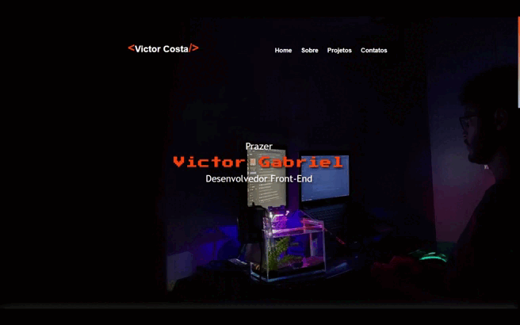

# 💻 Sobre o projeto

   
  

Projeto desenvolvido para apresentar e exercitar os conhecimentos adquiridos de Front-End, está presente no projeto as seguintes funcionalidades:

- [x] Botões animados de Interação redirecionando para Linkedin e GitHub;
- [x] Botão Animado para download do curriculo;
- [x] Acessibilidade para pessoas com deficiência visual e cegos; 
- [x] Melhor combinação de cores para visualização;
- [x] Resposividade para dispositivos.

## Demonstração 📷 

  

## GitHub Pages
Link para Website: https://victorcesilva.github.io/Portfolio/

## Autores

Desenvolvido por [@VictorCeS](https://github.com/VictorCeSilva)
👋🏽 Entre em contato! 

