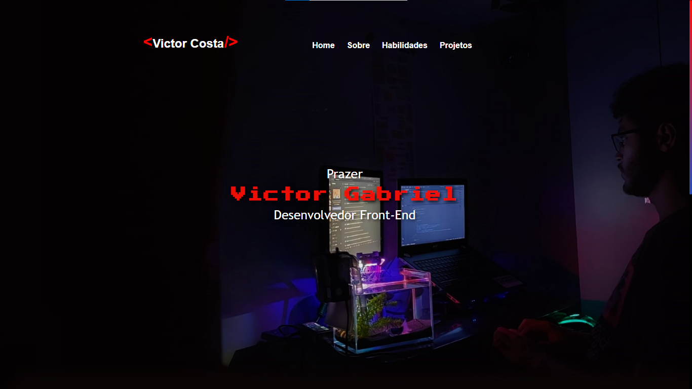

# 💻 Sobre o projeto

O projeto é destinado ao desenvolvimento do meu Portfolio profissional, 
contendo atualização de código e design. O intuito é demonstrar minhas  habilidades inseridas no portfolio e no meus projetos desenvolvidos.
A responsividade foi inserida com intuito de facilitar a visualização por dispositivos Mobiles.
---

<h4 align="center"> 
	🚧  HTML, CSS e JavaScript 🚀 Em construção...  🚧
</h4>

## Screenshots 	📷 

  Screenshot da tela inicial e demonstração da responsividade do Projeto!
<h1 align="center">
  
  
</h1>

##Autor

Feito por Victor Costa👋🏽 Entre em contato!
 

  
